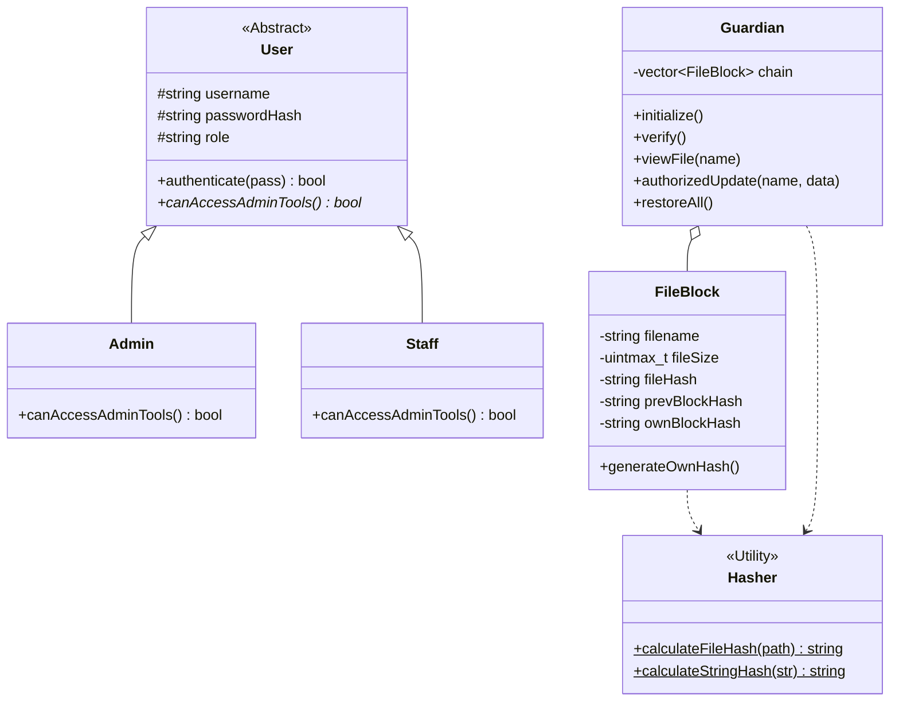

# 🛡️ Department File Guardian & Defender (v5.0)

A high-security, blockchain-based file integrity system developed in C++ using advanced Object-Oriented Programming (OOP) principles.

## 🚀 Overview
The **File Integrity Guardian** is designed to protect sensitive department documents. It creates a "Chain of Trust" where each file's security is linked to the previous one. If even a single bit of data is altered without authorization, the entire chain breaks, alerting the administrator.

### Key Features
- **Blockchain Data Integrity**: Uses a linked-hash structure to detect any unauthorized file modification.
- **Role-Based Access Control (RBAC)**: Distinct permissions for `Admin` and `Staff` users.
- **Self-Healing System**: Automatically restores corrupted or tampered files from a hidden secure backup.
- **OTP Authorization**: Requires a One-Time Password to authorize legitimate updates to documents.
- **Custom Cyber Algorithm**: Implements a custom bit-rotation and XOR-based hashing engine.

---

## 📊 Class Architecture (UML)



---

## 🛠️ OOP Concepts Applied

| Concept | Implementation in this Project |
|---------|--------------------------------|
| **Abstraction** | The `User` class is abstract, ensuring no "generic" users can exist. |
| **Inheritance** | `Admin` and `Staff` inherit from the `User` base class. |
| **Polymorphism** | Dynamic binding via `User*` pointers to handle role-specific menus. |
| **Encapsulation** | Private data members in `FileBlock` and `Guardian` protect internal states. |
| **Composition** | The `Guardian` class "owns" a collection of `FileBlock` objects. |

---

## 🔐 Cyber Algorithms

### 1. Blockchain Linking
Each file is represented by a `FileBlock`. The hash of `Block N` is calculated as:
`Hash(FileName + FileSize + FileData + Hash_of_Block_N-1)`
This ensures that changing one file invalidates all subsequent blocks.

### 2. Custom Bit-Rotation Hash
The `Hasher` class uses a custom mixing algorithm:
```cpp
hash = ((hash << 5) + hash) + data;
hash ^= (hash >> 3); // Bitwise diffusion
```

---

## 🛠️ Compilation & Execution

1. **Prerequisites**: G++ compiler with C++17 support.
2. **Compile**: 
   ```bash
   g++ main.cpp -o Guardian.exe -std=c++17
   ```
3. **Run**:
   ```bash
   .\Guardian.exe
   ```

### Default Credentials:
- **Admin**: `admin` / `admin123`
- **Staff**: `staff` / `staff123`
