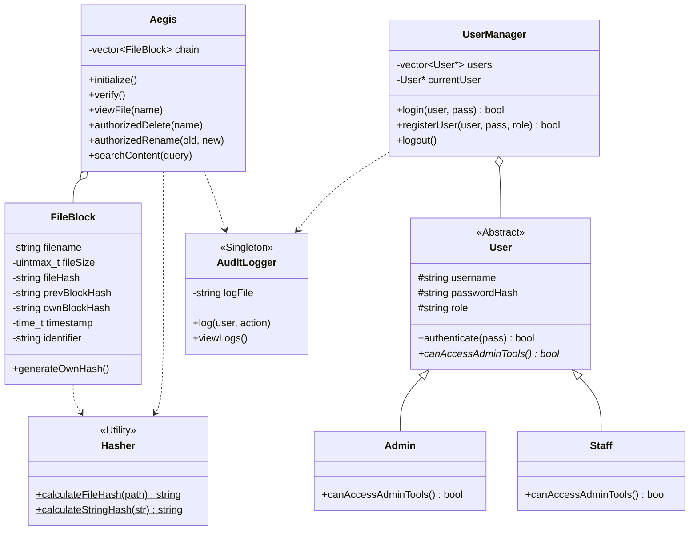

# 🛡️ Aegis Advanced Version Control & Security (v6.0)

A professional-grade, creative, and blockchain-based Document Management System (DMS) developed in C++ using advanced Object-Oriented Programming (OOP) principles.

## 🚀 Overview
**Aegis** is a high-security vault for sensitive documents. It combines traditional document management (CRUD) with a "Chain of Trust" architecture. Every file modification is sealed into a blockchain ledger, ensuring absolute data integrity. If a file is tampered with, the system detects it instantly and offers self-healing capabilities.

### Key Features
- **Full CRUD Management**: Create, View, Update, Overwrite, Rename, and Delete documents in the `Docs` directory.
*   **Blockchain Data Integrity**: Uses a linked-hash structure where every modification re-seals the entire chain.
*   **Persistent User Management**: Securely stores users and their roles with hashed password protection.
- **Role-Based Access Control (RBAC)**: Distinct permissions for `Level 4 (Admin)` and `Level 2 (Staff)` users.
- **Creative Terminal UI**: ANSI-colored interface, ASCII banners, and professional loading animations.
*   **Secure Audit Logging**: Every system action is recorded in a protected `audit.log` for forensic tracking.
- **OTP Authorization**: Destructive actions require a One-Time Password to prevent accidental changes.

---

## 📊 Class Architecture (UML)



---

## 🛠️ OOP Concepts Applied

| Concept | Implementation in this Project |
|---------|--------------------------------|
| **Abstraction** | `User` class is abstract; `AuditLogger` uses a private constructor (Singleton). |
| **Inheritance** | `Admin` and `Staff` extend `User` to define role-specific permissions. |
| **Polymorphism** | Dynamic menu rendering based on `User*` pointers and virtual methods. |
| **Encapsulation** | Strict data hiding in `FileBlock`, `UserManager`, and `AuditLogger`. |
| **Singleton** | The `AuditLogger` ensures a single point of truth for system activity. |

---

## 🛠️ Compilation & Execution

1. **Prerequisites**: G++ compiler with C++17 support.
2. **Compile**: 
   ```bash
   g++ main.cpp -o Aegis.exe -std=c++17
   ```
3. **Run**:
   ```bash
   .\Aegis.exe
   ```

### Default Credentials:
- **Admin**: `admin` / `admin123`
- **Admin 2**: `adminrafay` / `rafay123`
- **Staff**: `staff` / `staff123`
- **Admin Secret Key**: `guardian2026` (For registration)

### Group Members :
- Abdul Rafay 
- Hadia Aziz
- Huda Tariq
- Faizan Iqbal

